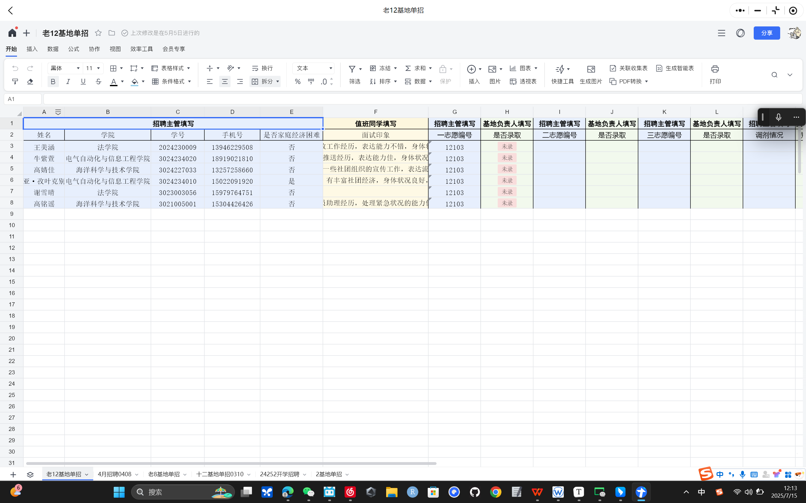
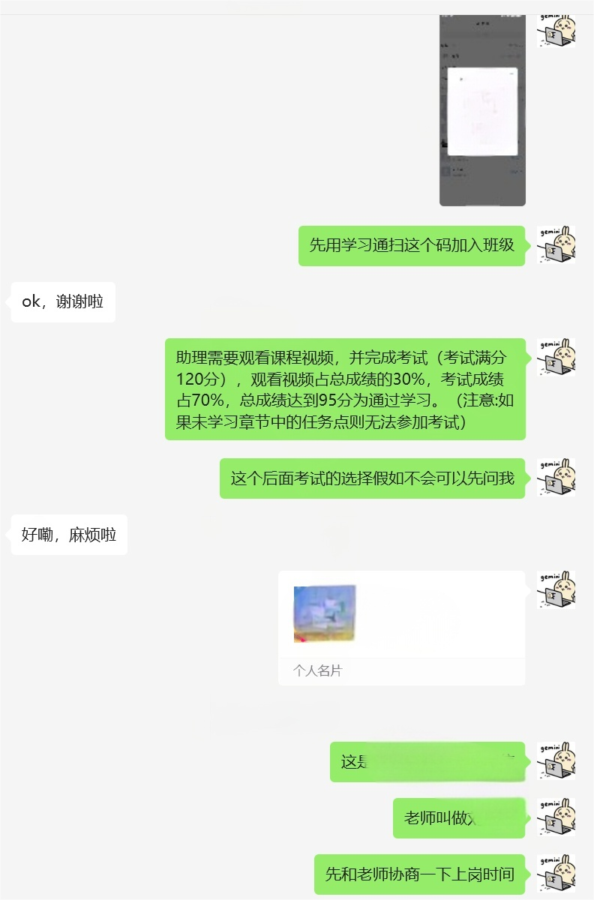
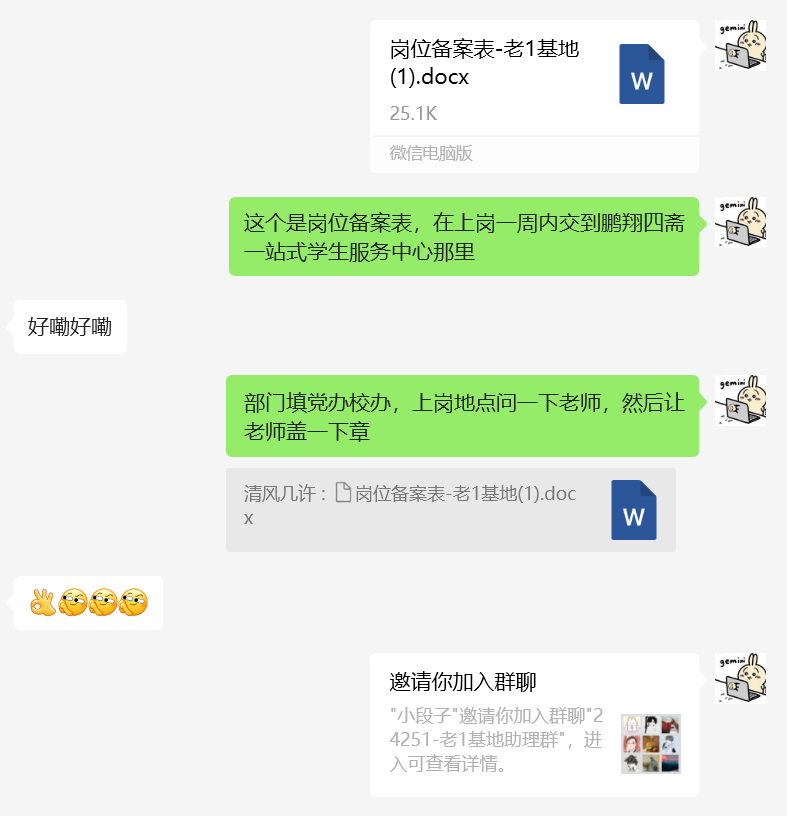

## 一、学期前

1. 确认留任助理
   在大群中发布留任助理的问卷，然后添加留任助理，新建一个学期的助理群
   最好是老师+学生两重确认
2. 上传助理审核标准

## 二、学期中

1. 每周值班一个半小时
   在鹏翔四斋一站式学生社区综合服务中心，记得要开始前在钉钉中考勤打卡中签到，然后在结束后签到并填写值班日志（钉盘->团队文件->全员文件夹->25261工作文件->值班文件）

2. 定期招聘

   一般开学后是有一个大招聘会，假如基地很缺人或者老师要求可以联系主任在天大学生资助发布招聘通知，以下是招聘流程

   1. 面试
      在自己值班时间面试，一般三个问题“家庭经济困难学生”“学生工作”“工作相关的能力”，然后将面试印象填写在在线文档中

   2. 筛选
      在在线文档中，根据自己需求按照志愿顺序选择需要的
      

   3. 学习通学习+推老师微信+发岗位备案表+邀请进基地群
      

      在后续中要督促助理交备案表，备案表要在一周之内交至鹏翔四斋一站式学生社区综合服务中心，另外需要在助理信息表中更新信息

3. 育人活动
   策划-举办-汇报，三个基地举办一个，考核是对参与的三个基地的基地助理参与情况，不是对育人活动举办内容效果

4. 定期联系老师交流

   每学期一次即可

5. 每月提交助理审核结果

## 三、学期结束前

1. 部门岗位延岗表+岗位确认单+岗位申请表（）
2. 述职大会
   准备PPT，将结合学期内表现评奖