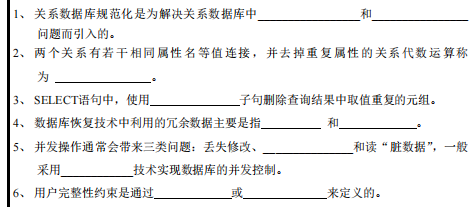

## 一、填空题（10道）

1. 21年的六道填空题都考到了

2. 删表的语句是drop,删数据的语句是delete

## 二、简答题

1. 恢复：关于具有检查点的恢复技术
2. 并发控制
3. 关系模式

## 三、程序设计题

和21年的题一样，只是有细微的修改

## 四、综合设计题

只记得大概是以下这个的样子：

> 某银行系统有以下业务需求：
>
> - 银行有多个分行，分行有分行编号、分行名称、地址等属性。
> - 客户通过身份证号唯一标识，有姓名、联系方式、地址等属性。
> - 银行账户分为储蓄账户和信用账户，它们都继承自账户实体。账户有账号、开户日期、账户状态等公共属性。储蓄账户有余额、年利率等属性；信用账户有信用额度、透支利率等属性。
> - 客户与分行之间存在开户关系，一个客户可以在多个分行开户，一个分行有多个客户开户。
> - 账户与分行之间通过开户关系关联，一个账户属于一个分行，一个分行有多个账户。
> - 客户可以在银行申请贷款，贷款有贷款编号、贷款金额、贷款期限、申请日期等属性。贷款与分行和客户之间存在申请关系，一个客户可以申请多笔贷款，一笔贷款由一个分行发放。
> - 贷款存在还款记录这一弱实体，依赖于贷款实体，有还款编号、还款日期、还款金额、还款方式等属性。
>
> 请根据以上业务需求，绘制 E - R 图并转化为关系模式。