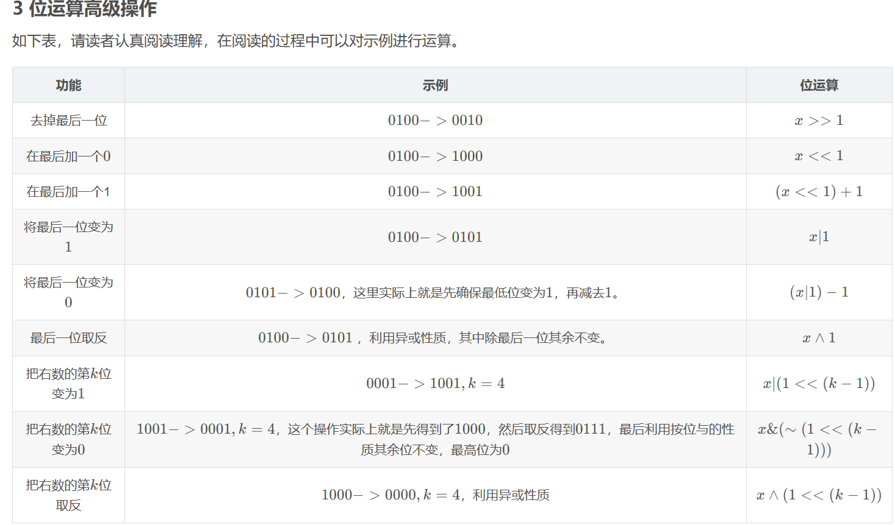
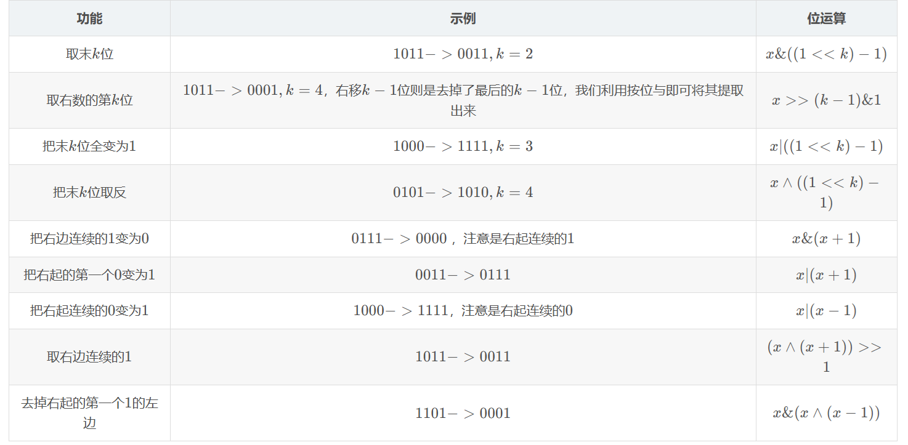
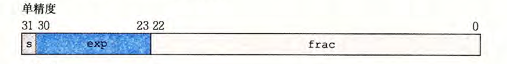
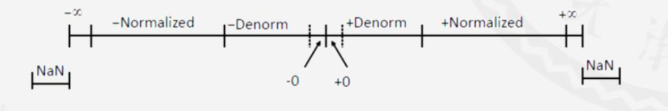

## 信息的存储

### 字长

- 计算机（CPU）一次整数运算能处理的位数
- 示例：
  - 32位系统：字长32
  - 64位系统：字长64

### 字节序

#### 小端序（LE - Little Endian）

- 低位字节存储在低地址

- 示例（0x3039在32位系统的存储）：

  ```hex
  39 30 00 00
  ```

#### 大端序（BE - Big Endian）

- 高位字节存储在低地址

- 示例（0x3039在32位系统的存储）：

  ```hex
  00 00 30 39
  ```

> 注意：指针指向1字节大小的内存，因此39、30作为两个整体存储

### 指针的存储

1. 不同编译器和计算机的指针可能分配到不同地址
2. 每次运行结果的指针都可能不同（安全考虑）

---

## 位运算、逻辑运算

### 基本操作

#### 位运算

```c
0x0F & 0xF0 = 0x00;  // 按位与
0x0F | 0xF0 = 0xFF;  // 按位或
0x0F ^ 0xFF = 0xF0;  // 异或
~0x00 = 0xFF;        // 取反
1 << 3 = 8;          // 左移（乘以8）
-8 >> 2 = -2;        // 算术右移（符号位填充）
```

#### 逻辑运算

```c
0 && 1 = 0;  // 逻辑与
0 || 1 = 1;  // 逻辑或
!0 = 1;      // 逻辑非
```

### 高级操作





> 建议结合LAB1复习（含典型例题）

---

## 整数的表示

### 无符号数

- 定义：所有位表示数值，无符号位
- 范围：$0$ 到 $2^w - 1$（w为位数）
- 示例（8位）：0~255

### 有符号数（补码表示）

- 定义：
  - 最高位为符号位（权重为负）
  - 正数：补码=原码
  - 负数：非符号位取反后+1

### 表示范围对比

| 类型     | 范围（w位）               |
| -------- | ------------------------- |
| 无符号数 | $0$ 到 $2^w - 1$          |
| 有符号数 | $-2^{w-1}$ 到 $2^{w-1}-1$ |

**示例（w=8）**：

- 无符号：0~255
- 有符号：-128~127

### C语言混用问题

```c
int a = -1;
unsigned int b = 1;
if(a > b) // 返回true（a被强制转换为无符号数0xFFFFFFFF）
```

> 注意：有符号数与无符号数混用时，有符号数隐式转换为无符号数，可能导致逻辑错误

---

## 整数的运算

### 整数扩展

| 类型     | 规则       | 示例（8位→16位）     |
| -------- | ---------- | -------------------- |
| 无符号数 | 0扩展      | 0xFE → 0x00FE（254） |
| 有符号数 | 符号位扩展 | 0xFE → 0xFFFE（-2）  |

### 整数截断

- 规则：丢弃高w-k位，保留低k位
- 示例：
  - 16位→8位：0x1234 → 0x34（52）
  - 16位有符号：0x8000（-32768）→ 0x00（0）

### 有符号数取反

- 公式：$-x = \sim x + 1$
- 原理：$x + \sim x = -1$

### 加法溢出检测

#### 无符号数

```c
if(a + b < a) // 发生溢出
// 示例：200+200=144（8位）
```

#### 有符号数

```c
if((a>0 && b>0 && a+b<0) || 
   (a<0 && b<0 && a+b>0)) // 发生溢出
// 示例：127+1=-128（8位）
```

### 乘法运算

| 类型     | 规则                    | 示例（8位）          |
| -------- | ----------------------- | -------------------- |
| 无符号数 | 结果取模$2^w$           | 200×2=144（400%256） |
| 有符号数 | 补码乘法，结果取模$2^w$ | 127×2=-2（254）      |

> C语言不检查乘法溢出

### 移位与乘除关系

| 操作   | 等效运算 | 适用性                               |
| ------ | -------- | ------------------------------------ |
| `<< x` | $×2^x$   | 无符号/有符号均适用                  |
| `>> x` | $÷2^x$   | 无符号数（逻辑右移）                 |
| `>> x` | $÷2^x$   | 有符号数（算术右移，负数有舍入问题） |

---

## 浮点数

### 规格化数（以float为例）

- 编码结构：
  - 符号位（s）：1位
  - 阶码（exp）：8位
  - 尾数（frac）：23位
- 计算公式：
  $x = (-1)^s \times (1.\text{frac}) \times 2^{\text{exp}-127}$
- 特性：指数越大，数值间隔越大（指数增长）



### 非规格化数

- 触发条件：exp = 000...0
- 计算公式：
  $x = (-1)^s \times (0.\text{frac}) \times 2^{-126}$
- 特殊值：
  - $\text{frac}=0, s=0$ → +0.0
  - $\text{frac}=0, s=1$ → -0.0
- 特性：0附近等间距分布（间隔=$2^{-149}$）

### 特殊值

| exp  | frac  | 含义       |
| ---- | ----- | ---------- |
| 全1  | 全0   | ±∞（溢出） |
| 全1  | 非全0 | NaN        |

### 浮点数分布



### 溢出类型

| 类型   | 结果                   |
| ------ | ---------------------- |
| 上溢出 | ±∞（超出最大可表示值） |
| 下溢出 | 0或逐步下溢            |

---

## 浮点数运算

### C语言类型转换

| 转换方向         | 行为                       | 示例               |
| ---------------- | -------------------------- | ------------------ |
| double→float     | 可能溢出/舍入              | 大值→±∞            |
| float/double→int | 向零舍入                   | 1.999→1, -1.999→-1 |
| int→float/double | 精确转换（double精度更高） | 保留精确值         |

> 历史教训：1996年Ariane5火箭因浮点数转整数错误导致爆炸（5亿美元损失）

### 舍入规则

- 向偶数舍入（Round-to-even）
- LAB2提供详细实现

> 浮点数运算不符合结合律/分配律：$(3.14+1e10)-1e10 \neq 3.14+(1e10-1e10)$