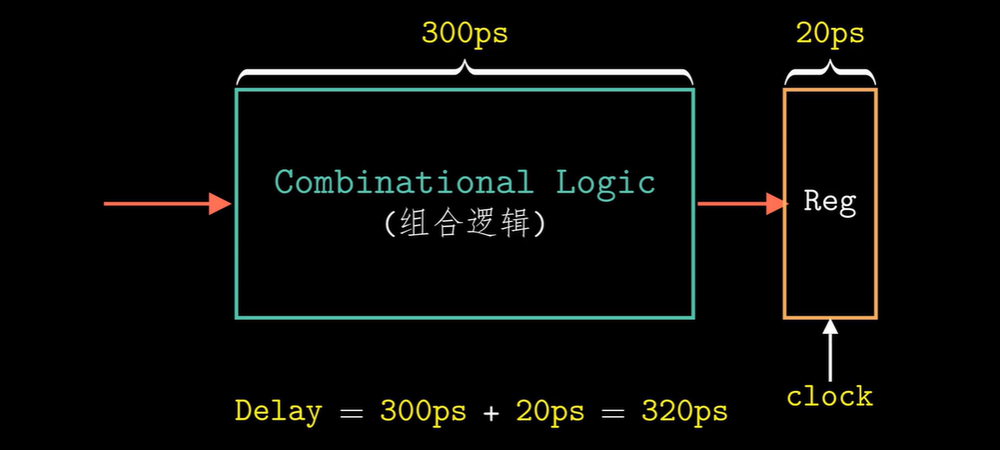
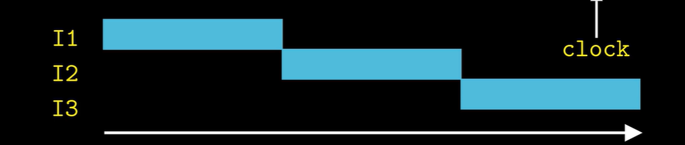
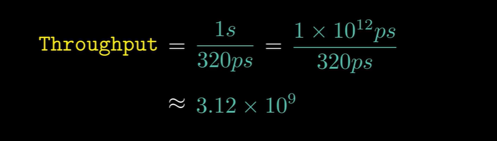
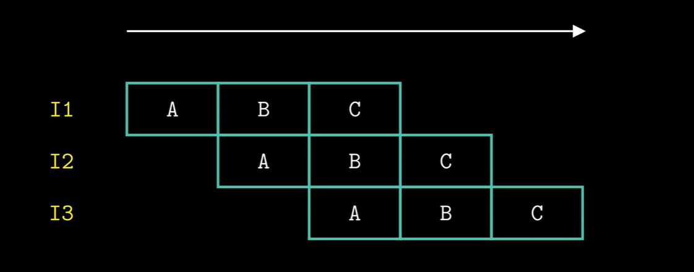
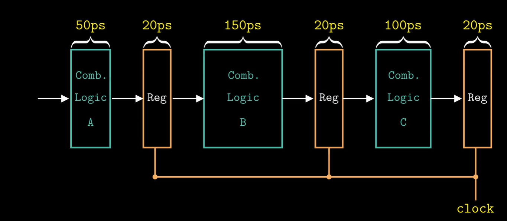
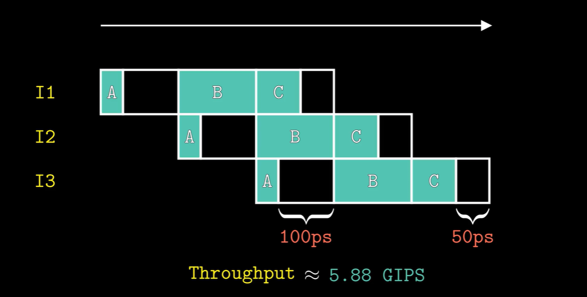

#### 流水线

##### 未流水化硬件设计

（这是一个例子，通过组合逻辑门的时间假设是300ps，加载到寄存器的时间假设是20ps，总延迟就是320ps)

##### 流水线抽象

（不要管右上角的clock)

##### 指令吞吐量（评估流水线效率）

指令吞吐量是指处理器在单位时间内完成的指令数量。在流水线中，理想情况下每个时钟周期可以完成一条指令（即吞吐量为1指令/周期）。
对上面给出的两个图进行评估：

一秒钟可以进行10⁹次操作。
引入单位 **GIPS**（每秒十亿条指令或每秒千兆条指令)。

##### 基本原理

流水线技术通过将指令处理过程分解为多个阶段（stage），使得多个指令可以同时处于不同的处理阶段，从而提高处理器的吞吐率。类似于工厂的装配线。
演示图如下：

（中间出现了三个操作都处理的时候)

**加速比** = 非流水线执行时间 / 流水线执行时间
（应用流水线得到的效率提升的量化）

##### 流水线非理想情况

###### 各个阶段延迟不等

（受最慢因素限制）
流水线图如下：

（吞吐量下降)

###### 流水线过深

- **分支预测惩罚增大**分支结果确定前需执行更多后续指令，预测错误时清空流水线代价更高。
- **流水线气泡比例上升**填充/排空流水线所需周期数随深度线性增加，短指令序列效率显著降低。
- **硬件复杂度激增**需更多流水线寄存器、更复杂的冒险检测和转发电路，功耗与面积大幅增加。
- **资源冲突加剧**
  多级流水线争用同一功能单元（如内存端口），需增加冗余资源导致成本上升。

##### 经典的五级流水线结构

1. **取指**从内存取指令。
2. **译码**对取出的指令进行译码，识别操作码和操作数，读取寄存器文件中的值。
3. **执行**执行指令所需的操作，如算术运算、逻辑运算等。
4. **访存**访问数据存储器，如加载（Load）或存储（Store）数据。
5. **写回**
   将执行结果或从内存中读取的数据写回到寄存器文件。

##### 流水线的局限性

阶段延迟不均衡、流水线启动/排空开销、资源冲突、依赖导致的停顿。
**举例**：如果有某个步骤开销过大，那么其他指令都受其时间开销的制约。

##### 指令间的数据依赖

- **插入延迟（气泡）**分三类：
  - **RAW**（写后读）
  - **WAR**（读后写）
  - **WAW**（写后写）
    在按序流水线中，主要面临RAW依赖，而乱序执行可以处理所有依赖。
- **乱序执行**
  动态调度指令，绕过依赖提前执行后续独立指令。

###### 指令间的控制依赖

遇到 `if-else`产生的分支指令时，流水线要停顿。
**缓解措施**：通常通过分支预测技术来缓解，即预测分支的方向，提前取指执行。
