## 存储技术

### 非易失存储器
- ROM, PROM, EPROM, EEPROM, flash memory

### RAM（随机访问存储器/易失寄存器）
#### SRAM(静态RAM)
- 将每个位存储在一个双稳态存储器单元（六晶体管电路实现）
- 特点：  
  只要有电则永久保持值，抗干扰能力强（干扰消除后恢复稳定值）

#### DRAM（动态RAM）
- 将每个位存储为电容充电
- 特点：  
  结构密集（每单元=1电容+1访问晶体管），对干扰敏感（电压扰乱后不可恢复），光照影响电压
- **主存组成**：DRAM芯片构成

#### RAM总结


### 磁盘
#### 结构
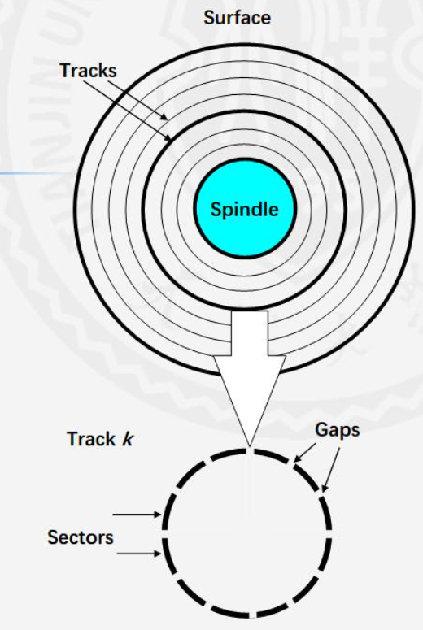
- **盘片**：多个转盘组合
- **面**：每盘片两个存储面
- **磁道（柱面）**：
  - 同心圆结构
  - **柱面**：所有盘片相同半径的磁道集合
- **扇区**：磁道分段，扇区间有间隙分隔

#### 容量
**决定因素**：  
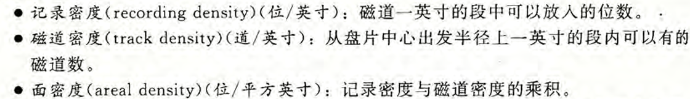  
**计算公式**：  
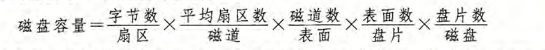  
**示例**：  
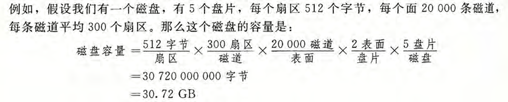

#### 扇区访问
1. **寻道时间**：移动磁头到目标磁道的时间
2. **旋转时间**：等待目标扇区转到磁头下  
     
   **最坏情况**：需等待磁盘转一整圈  
   
3. **传送时间**：读取扇区数据的时间  
   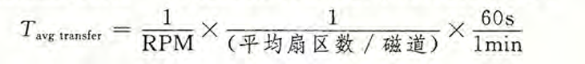

**平均访问时间示例**：  
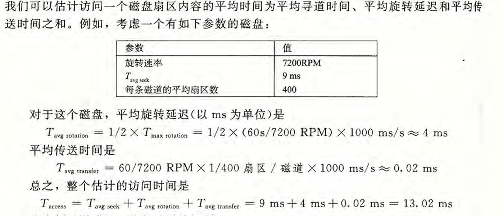

### 固态硬盘(SSD)
- 基于闪存的存储技术
- **与磁盘比较**：  
  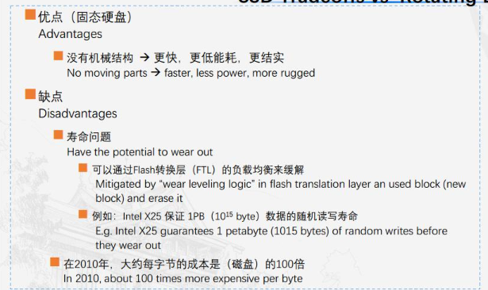

### 存储技术趋势
1. 处理器和存储器性能持续提升
2. 处理器与存储器性能差距不断扩大

---

## 局部性原理

### 时间局部性
- 特点：被访问过的位置很可能短期内再次访问  
  **示例**：  
  ```c
  int sum = 0;
  for (int i = 0; i < n; i++) {
      sum += a[i];  // sum被重复访问
  }
  
```
```
  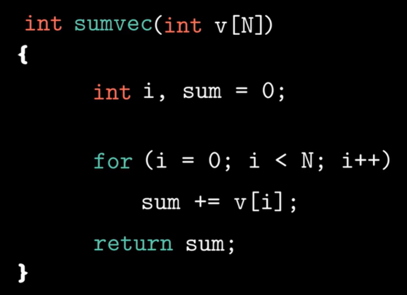

### 空间局部性
- 特点：访问某个位置后很可能访问其邻近位置  
  **良好示例（行优先遍历）**：  
  ```c
  for (int i = 0; i < n; i++) {
      for (int j = 0; j < n; j++) {
          sum += a[i][j]; 
      }
  }
  ```
  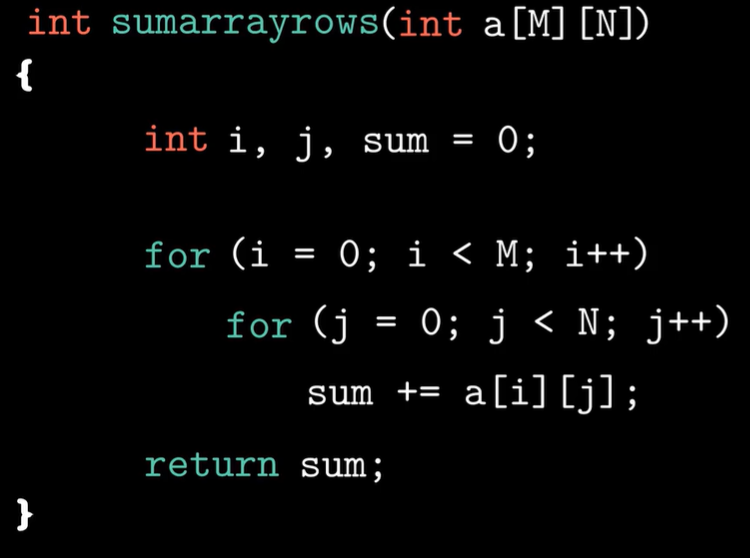  

  **较差示例（列优先遍历）**：  
  ```c
  for (int j = 0; j < n; j++) {
      for (int i = 0; i < n; i++) {
          sum += a[i][j];
      }
  }
  ```
  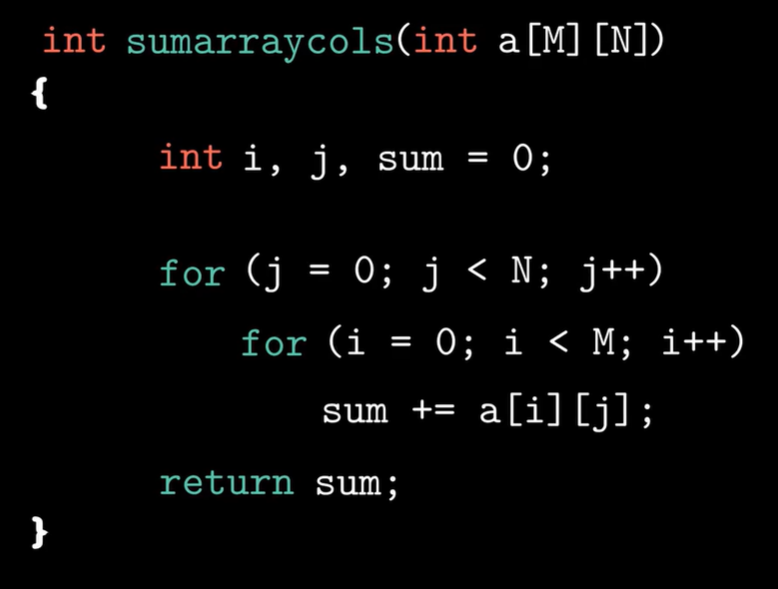

---

## 存储器层次结构

### 金字塔结构
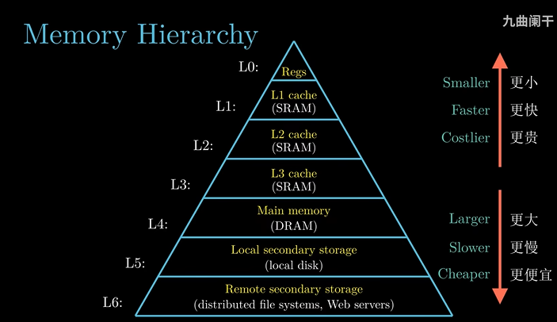  
- **高层特点**：速度快、单位成本高
- **底层特点**：速度慢、单位成本低
- **核心思想**：用高层缓存底层数据，以低成本获取高性能

### 缓存机制
  
（第k层是k+1层的缓存)

#### 缓存命中
- 在k层找到目标数据副本

#### 缓存未命中
- **冷未命中**：缓存初始为空时的首次访问（如程序启动）
- **冲突未命中**：多数据块映射到同一缓存组（直接映射/组相联中发生）
- **容量未命中**：工作集超过缓存容量（频繁访问大量数据时）

---

## 高速缓存

### 访问流程
1. 地址解析
2. 定位组(set)
3. 组内匹配行(line)

### 结构组成
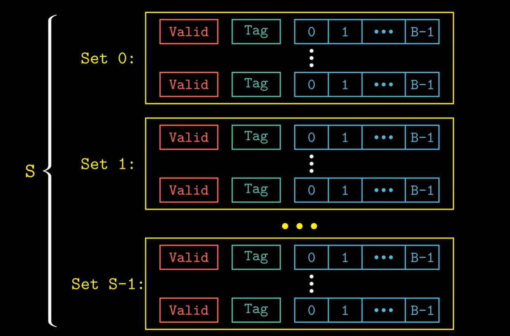  
- **组(Set)**：包含E个缓存行  
  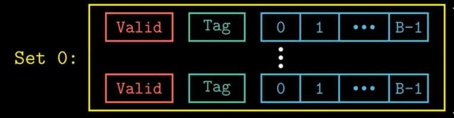
- **行(Block)**：  
    
  - `valid`：数据有效性（1=有效）
  - `tag`：标识数据来源
  - `block data`：数据块

### 地址解析
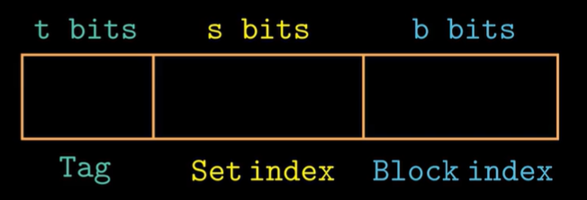  
- **组选择(set index)**：中位地址选组（避免相邻块冲突）
- **行匹配(tag)**：高位地址匹配有效行
- **字选择(block offset)**：低位地址选块内字节

### 组织方式

#### 直接映射（每组1行）
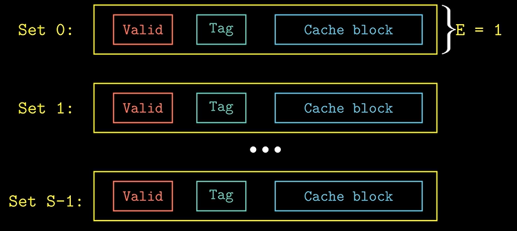  
**地址划分示例**：  
  

- **特点**：结构简单、速度快，易冲突未命中

#### 组相联映射（每组E≥2行）
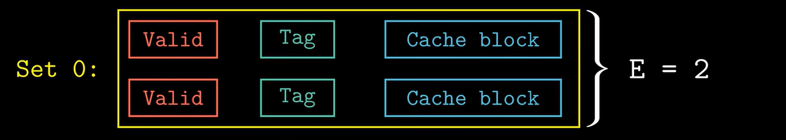  
**块替换算法**：  

| 算法 | 机制                  | 特点                     |
|------|-----------------------|--------------------------|
| Random | 随机选择替换行        | 简单，硬件成本低         |
| LRU  | 替换最久未访问行      | 高效，需记录访问时间     |
| LFU  | 替换访问频率最低行    | 对突发访问敏感，需计数器 |

**特点**：灵活性/复杂度/速度折中

#### 全相联映射（仅1组）
  
**地址划分**：  
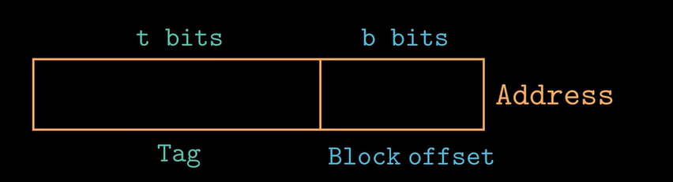  
**特点**：结构复杂速度慢，灵活性最高

### 评价指标
- **未命中率** = 1 - 命中率
- **平均访问时间** = 命中时间 + 未命中惩罚 × 未命中率

### 写策略
| 场景       | 策略                | 特点                                                                 |
|------------|---------------------|----------------------------------------------------------------------|
| **写命中** | 直写(write-through) | 同时写缓存+下层；数据一致性好，速度慢                                |
|            | 回写(write-back)    | 仅写缓存，替换时写回；速度快，需维护"脏位"(dirty bit)                |
| **写未命中**| 写分配(write-alloc) | 加载目标块到缓存后更新（常配回写）                                   |
|            | 非写分配(not-write-alloc) | 直接写下层，不加载缓存（常配直写）                                   |

**策略组合**：
- 性能优先：回写 + 写分配
- 一致性优先：直写 + 非写分配

---

## 编写高速缓存友好代码
**优化示例（矩阵乘法）**：
1. 循环重排序 → 提升空间局部性
2. 矩阵分块 → 提升时间局部性

---

## 存储器山
- **定义**：测量不同工作集大小/步长(stride)时的读取带宽三维图
- **山脊**：工作集完全适应缓存时的高带宽
- **斜坡**：步长增大或工作集超缓存容量时带宽下降
- **Intel Prefetch技术**：  
  硬件预取顺序访问数据，使步长=1时大工作集仍保持高带宽
```


  