## 基本概念

### 编译过程

#### 预处理

- 处理源代码中的预处理指令，如宏定义、条件编译、头文件包含等

- 例：

  ```bash
  gcc -E main.c -o main.i  # 将 main.c 预处理为 main.i
  ```

#### 编译

- 将预处理后的文件转换为汇编代码

- 例：

  ```bash
  gcc -S main.i -o main.s  # 将 main.i 编译为 main.s
  ```

#### 汇编

- 将汇编代码转换为机器指令（目标文件）

- 例：

  ```bash
  gcc -c main.s -o main.o  # 将 main.s 汇编为 main.o（可重定位目标文件）
  ```

#### 链接

- 将多个目标文件和库文件合并为一个可执行文件

- 例：

  ```bash
  gcc main.o func.o -o prog  # 将 main.o 和 func.o 链接为可执行文件 prog
  ```

### 为什么要链接

#### 模块化

- 将程序分成多个模块，便于开发和维护

#### 提高构建程序的效率

- **时间**：只重新编译修改过的模块，然后重新链接，节省时间
- **空间**：多个程序可以共享相同的库代码（动态链接），节省磁盘空间

### 目标文件

#### 可重定位目标文件（Relocatable Object File）

- 包含代码和数据，但尚未指定绝对地址，需要链接后才能运行
- 文件格式：`.o`（Linux）或 `.obj`（Windows）

#### 可执行目标文件（Executable Object File）

- 包含可直接加载到内存中执行的程序
- 文件格式：`a.out`（Linux）或 `.exe`（Windows）

#### 共享目标文件（Shared Object File）

- 可以在加载或运行时被动态地加载到内存并链接
- 文件格式：`.so`（Linux）或 `.dll`（Windows）

#### ELF文件结构

- 可执行和可链接格式（Executable and Linkable Format）
- 使用 `readelf -a main.o` 查看ELF文件结构
- 结构图：
  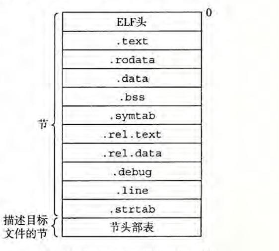

| 节区      | 描述                                                         |
| --------- | ------------------------------------------------------------ |
| .text     | 已编译程序的机器代码                                         |
| .rodata   | 只读数据（如printf格式串和switch跳转表）                     |
| .data     | 已初始化的全局和静态C变量（局部变量在栈中）                  |
| .bss      | 未初始化的全局和静态C变量（目标文件中不占空间，仅为占位符）  |
| .symtab   | 符号表（存放函数和全局变量信息，不包含局部变量）             |
| .rel.text | 代码重定位信息（链接时需要修改的位置）                       |
| .rel.data | 数据重定位信息（被模块引用或定义的全局变量重定位信息）       |
| .debug    | 调试符号表（-g选项编译时生成，含局部变量和类型定义）         |
| .line     | 源程序行号与机器指令的映射（-g选项编译时生成）               |
| .strtab   | 字符串表（包含.symtab和.debug节的符号名称，以null结尾的字符串序列） |

### 符号和符号表

#### 符号类型

| 类型     | 描述                                                    |
| -------- | ------------------------------------------------------- |
| 全局符号 | 由模块m定义并能被其他模块引用（不带static）             |
| 外部符号 | 由其他模块定义并被模块m引用的全局符号                   |
| 局部符号 | 只被模块m定义和引用（带static属性），不能被其他模块引用 |

#### 符号表

- 描述当前ELF文件中定义和引用的符号
- 格式：
  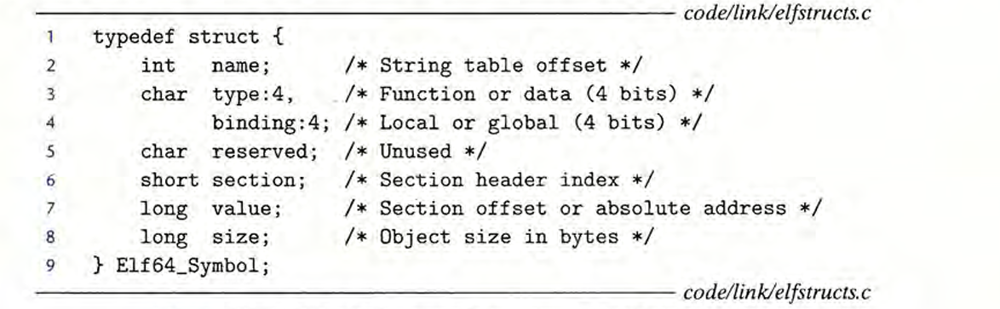
  示例：
  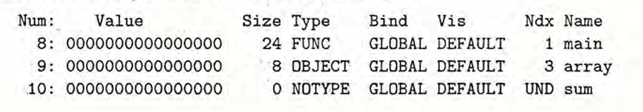

---

## 静态链接

### 符号解析

- 将每个引用（外部符号）与其他可重定向目标文件的符号表中的符号定义关联起来

#### 多重定义的全局符号

| 类型   | 描述                     |
| ------ | ------------------------ |
| 强符号 | 已初始化的全局变量和函数 |
| 弱符号 | 未初始化的全局变量       |

**解析规则**：

1. 多个同名强符号 → 链接报错
2. 一个强符号和多个弱符号同名 → 选择强符号
3. 多个弱符号同名 → 任意选择一个

#### 头文件作用

- 包含函数的声明
- 通过 `#include` 预编译到源文件中
- 便于链接函数的源文件

### 符号解析错误示例

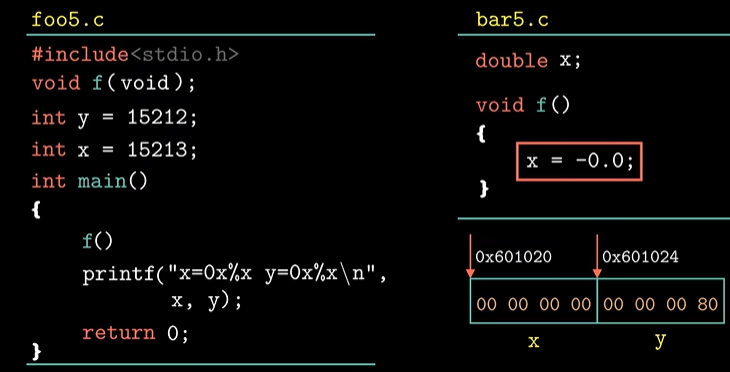**解释**：

- `int x = 15213;` 是强符号
- `double x;` 是弱符号
- 内存分配：
- 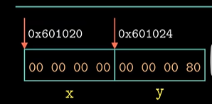
- 执行 `f()` 函数将 `x` 解释为 `double` 会导致 `y` 被覆盖

### 重定位

#### 重定位节和符号定义

- 合并多个目标文件中相同类型的节
- 为每条指令和全局变量分配地址

#### 重定位节中的符号引用

- **重定位条目结构**：
  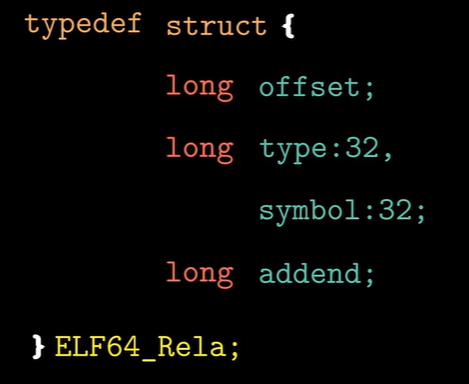

  **相对引用样例**：

  > 注：addend是引用函数地址与callq下一行地址的差值

  **绝对引用样例**：

  > 注：绝对引用地址的addend设置为0

### 静态链接全过程演示

**代码**：


链接操作：

- 维护三个集合：
  - `E`：目标文件
  - `U`：未定义符号
  - `D`：已定义符号

**步骤**：

1. 处理 `main.o`：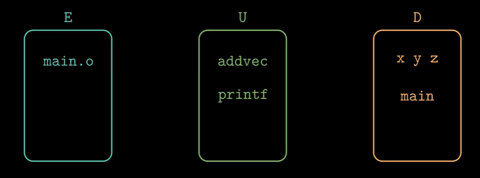
2. 处理 `./libvector.a`（寻找 `U` 中的函数）：
   - 发现 `addvec` 并加载到 `E`
     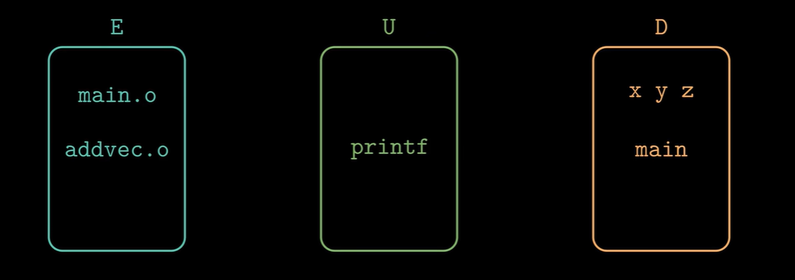
3. 处理 `libc.a`（寻找剩余未定义符号）：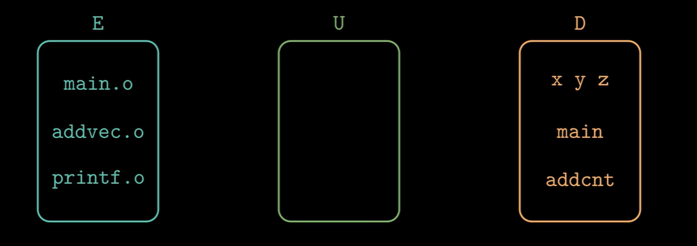
4. 当 `U` 为空时，整合 `E` 为可执行文件
   - 若 `U` 非空 → 链接器报错
5. 获取目标文件代码节和数据节大小信息 → 开始重定位

---

## ELF文件的加载

### 内存中的节区

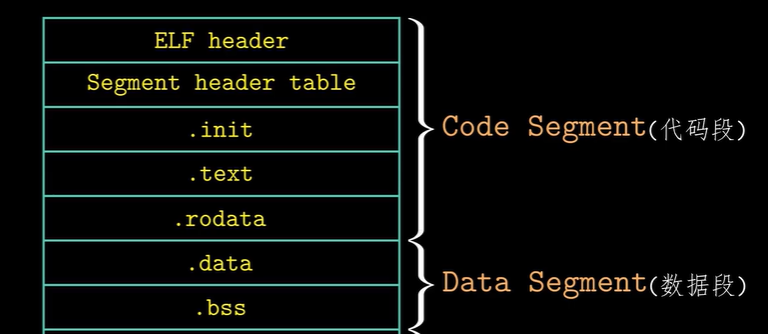

### 不在内存中的节区


### 内存布局

- **代码段**：只读内存段
- **数据段**：读/写内存段

**Linux程序运行时内存布局**：
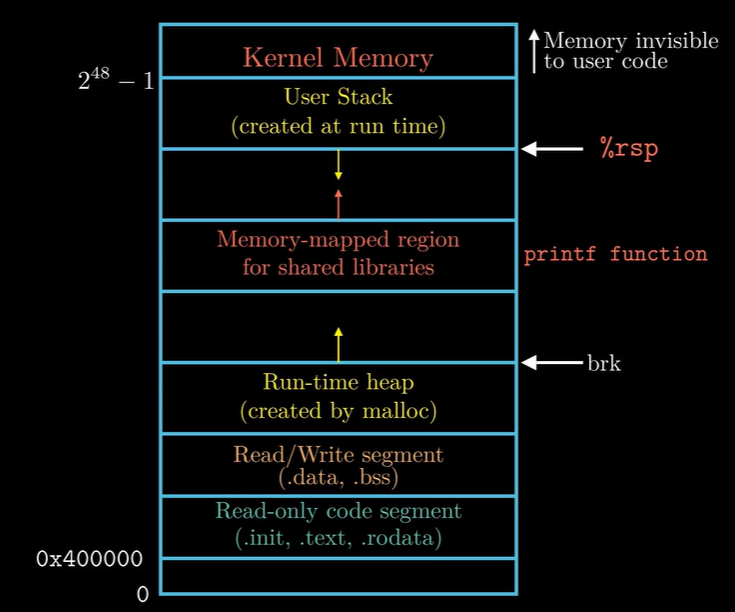

**从低地址到高地址**：

1. 只读内存段（代码）
2. 读/写数据段
3. 堆
4. 间隔
5. 共享模块
6. 间隔
7. 栈
8. 使用者不可见区域

> 注：代码段和数据段之间因对齐要求存在间隙

---

## 静态库

### 产生原因

1. 库函数封装在同一个目标文件 → 可执行文件体积过大，链接时间长
2. 每个库函数单独封装 → 链接过程繁琐

### 实现原理

- 包含多个可重定位目标文件的归档文件
- 归档文件中存放各目标文件的索引

### 链接静态库

- GCC编译选项：`-L`（库路径）、`-l`（库名）

### 链接器解析顺序

- 按需解析符号依赖

### 缺陷

1. 多个程序包含相同的静态库代码 → 磁盘空间浪费
2. 内存中为相同静态库分配独立空间 → 内存浪费
3. 静态库更新需重新链接整个程序

---

## 共享（动态）库

### 优势

1. 程序不包含共用代码 → 节省存储空间
2. 内存中只加载一次 → 多进程共享，节省内存
3. 动态库更新无需重新构建程序

### 动态链接

#### 加载时链接

- GCC编译选项：`-L`、`-l`

#### 运行时链接

- 使用 `dlfcn.h` 接口：

  ```c
  void *dlopen(const char *filename, int flag);  // 打开动态库
  void *dlsym(void *handle, const char *symbol); // 获取函数指针
  int dlclose(void *handle);                    // 关闭动态库
  const char *dlerror(void);                    // 错误处理
  ```

#### 动态链接器

- Linux：`ld-linux.so`
- Windows：`ntdll.dll`

### 位置无关代码（PIC）

#### 构建

- GCC编译选项：`-shared`（生成共享库）、`-fpic`（生成位置无关代码）

#### 位置无关数据引用

- 全局偏移量表（GOT）
- 相对位置寻址

#### 位置无关函数的调用

- 延迟加载
- 全局偏移量表（GOT）→ `.data` 节
- 过程链接表（PLT）→ `.text` 节

---

## 库打桩

### 编译时打桩

- 通过宏定义在预编译阶段替换符号
- 缺点：需要修改源代码

### 链接时打桩

- 利用GCC编译选项在符号解析时替换符号
- 缺点：需重新构建程序

### 运行时打桩

- 通过 `LD_PRELOAD` 环境变量：

  ```bash
  LD_PRELOAD="./mylib.so" ./program
  ```

- 原理：使打桩库先于实际库加载，符号重定位至打桩库
